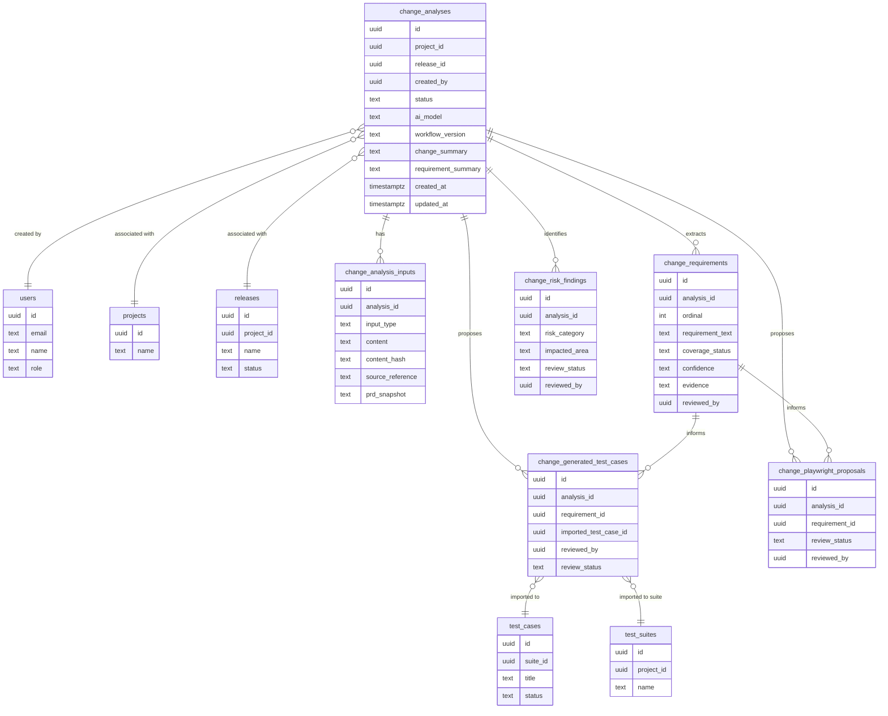

# Data Model — Change Intelligence

## Overview

Change Intelligence uses additive database migrations only. No existing table, column, or constraint is modified or removed. All new columns are nullable or carry safe defaults unless explicitly required for data integrity.

**Schema status:** [PROPOSAL] — All table definitions below are proposed. They must be reviewed by the implementing engineer before any migration is written. Confirmed patterns from Milestone 0 are marked as such.

**Migration file:** `030_change_intelligence.sql` — introduced in Milestone 2. Not introduced in Milestone 1.

---

## Confirmed Database Conventions

These patterns were confirmed by Milestone 0 inspection and must be followed by all Change Intelligence tables:

| Convention | Pattern |
|------------|---------|
| Primary keys | `id UUID PRIMARY KEY DEFAULT gen_random_uuid()` |
| Created timestamp | `created_at TIMESTAMPTZ NOT NULL DEFAULT NOW()` |
| Updated timestamp | `updated_at TIMESTAMPTZ NOT NULL DEFAULT NOW()` managed by `set_updated_at()` trigger |
| JSONB usage | Used for structured arrays and snapshots (e.g., `steps`, `ai_analysis`, `result`) |
| Owned children | `ON DELETE CASCADE` |
| Optional references | `ON DELETE SET NULL` |
| Soft deletes | Not used. Hard deletes only. |
| Migration runner | New tables (`CREATE TABLE IF NOT EXISTS`) are safe. `ALTER TABLE` on superuser-owned tables may require guarded DO blocks. |
| `created_by` type | `UUID REFERENCES users(id) ON DELETE SET NULL` — nullable, UUID FK pattern (see D-011) |
| `reviewed_by` type | `UUID REFERENCES users(id) ON DELETE SET NULL` — nullable |

---

## Existing Tables Referenced

Change Intelligence references existing tables via nullable foreign keys. These tables are not modified.

| Existing Table | How Change Intelligence Uses It | FK Nullable? |
|---------------|--------------------------------|--------------|
| `users` | `created_by`, `reviewed_by` attribution on all CI tables | Yes |
| `projects` | Associate an analysis with a project | Yes — analysis works without a project |
| `releases` | Optionally link an analysis to a release | Yes — a release is not required in Phase 1 |
| `test_cases` | Import approved generated cases into the existing library | References created on import |
| `test_suites` | Assign approved cases to an existing suite | Optional, on import |

Change Intelligence does not reference AI Studio tables (`prd_documents`, `ai_generation_sessions`, `ai_generated_test_cases`, `prd_gaps`). See D-008.

---

## [PROPOSAL] New Tables

All schemas below are proposals subject to implementation review. Names, columns, and types may be adjusted before migration is written. The migration file is `030_change_intelligence.sql`, introduced in Milestone 2.

---

### `change_analyses`

Top-level record for a Change Intelligence analysis. Created when a user submits an analysis. Tracks lifecycle status, AI configuration used, and summary outputs.

| Column | Type | Nullable | Default | Description |
|--------|------|----------|---------|-------------|
| `id` | `uuid` | No | `gen_random_uuid()` | Primary key |
| `project_id` | `uuid` | Yes | `NULL` | FK → `projects.id` ON DELETE SET NULL |
| `release_id` | `uuid` | Yes | `NULL` | FK → `releases.id` ON DELETE SET NULL — associating with a release is optional in Phase 1 |
| `created_by` | `uuid` | Yes | `NULL` | FK → `users.id` ON DELETE SET NULL |
| `status` | `text` | No | `'draft'` | `draft`, `submitted`, `complete`, `error` |
| `ai_model` | `text` | Yes | `NULL` | Model identifier used for this analysis (from resolved model chain) |
| `workflow_version` | `text` | Yes | `NULL` | Prompt/workflow version string, e.g., `"m2-v1"` |
| `change_summary` | `text` | Yes | `NULL` | AI-generated prose summary of what the PR changes |
| `requirement_summary` | `text` | Yes | `NULL` | AI-generated prose summary of requirement coverage |
| `created_at` | `timestamptz` | No | `NOW()` | |
| `updated_at` | `timestamptz` | No | `NOW()` | Managed by `set_updated_at()` trigger |

**Notes:**
- `draft` status is retained to support future async submission without a migration.
- The `feature_enabled_at_creation` column from earlier blueprint drafts is omitted — it is not needed because the feature flag is checked at request time and stored analyses are always associated with sessions that passed the flag check.
- `change_summary` and `requirement_summary` appear in the API response shape; they are stored here to avoid re-fetching aggregated data on every GET.

---

### `change_analysis_inputs`

Stores raw inputs for an analysis. Multiple rows per analysis are possible (one per input type submitted).

| Column | Type | Nullable | Default | Description |
|--------|------|----------|---------|-------------|
| `id` | `uuid` | No | `gen_random_uuid()` | Primary key |
| `analysis_id` | `uuid` | No | — | FK → `change_analyses.id` ON DELETE CASCADE |
| `input_type` | `text` | No | — | `pr_diff`, `requirement_text`, `jira_story`, `acceptance_criteria`, `prd_document`, `markdown_spec` |
| `content` | `text` | Yes | `NULL` | Raw input text. Full diff stored in Phase 1 — subject to retention policy (see D-017) |
| `content_hash` | `text` | Yes | `NULL` | SHA-256 of `content` at submission time, for change detection |
| `source_reference` | `text` | Yes | `NULL` | Optional reference string (e.g., Jira ticket ID, `prd_documents.id`) |
| `prd_snapshot` | `text` | Yes | `NULL` | If referencing an AI Studio PRD document, a snapshot of its `md_content` at analysis time (see OD-006 resolution) |
| `created_at` | `timestamptz` | No | `NOW()` | |

**Notes:**
- `analysis_id` uses `ON DELETE CASCADE` — inputs are owned by the analysis.
- The retention policy for `content` (full diff) is temporarily unrestricted. See D-017 and OD-009.

---

### `change_requirements`

Structured requirements extracted from the requirement inputs. One row per extracted requirement.

| Column | Type | Nullable | Default | Description |
|--------|------|----------|---------|-------------|
| `id` | `uuid` | No | `gen_random_uuid()` | Primary key |
| `analysis_id` | `uuid` | No | — | FK → `change_analyses.id` ON DELETE CASCADE |
| `ordinal` | `integer` | No | — | Display order |
| `requirement_text` | `text` | No | — | The extracted requirement statement |
| `source_type` | `text` | Yes | `NULL` | Which input type this was extracted from |
| `coverage_status` | `text` | Yes | `NULL` | `implemented`, `partial`, `missing`, `ambiguous`, `unable_to_verify` |
| `evidence` | `text` | Yes | `NULL` | Diff excerpt or reasoning supporting the status |
| `confidence` | `text` | Yes | `NULL` | `high`, `medium`, `low` |
| `reviewer_override` | `text` | Yes | `NULL` | Human reviewer's override status if different from AI assignment |
| `reviewer_note` | `text` | Yes | `NULL` | Reviewer's explanation for the override |
| `reviewed_by` | `uuid` | Yes | `NULL` | FK → `users.id` ON DELETE SET NULL |
| `reviewed_at` | `timestamptz` | Yes | `NULL` | |
| `created_at` | `timestamptz` | No | `NOW()` | |

---

### `change_risk_findings`

Risk and regression findings from the analysis. One row per finding.

| Column | Type | Nullable | Default | Description |
|--------|------|----------|---------|-------------|
| `id` | `uuid` | No | `gen_random_uuid()` | Primary key |
| `analysis_id` | `uuid` | No | — | FK → `change_analyses.id` ON DELETE CASCADE |
| `risk_category` | `text` | Yes | `NULL` | `data_integrity`, `auth`, `performance`, `ui_regression`, `unexpected_behavior` — list is extensible |
| `impacted_area` | `text` | Yes | `NULL` | Product area or component affected |
| `description` | `text` | No | — | Description of the risk |
| `evidence` | `text` | Yes | `NULL` | Supporting excerpt from the diff or requirement |
| `confidence` | `text` | Yes | `NULL` | `high`, `medium`, `low` |
| `review_status` | `text` | No | `'unreviewed'` | `unreviewed`, `acknowledged`, `disputed` |
| `reviewer_note` | `text` | Yes | `NULL` | Reviewer's note on acknowledgment or dispute |
| `reviewed_by` | `uuid` | Yes | `NULL` | FK → `users.id` ON DELETE SET NULL |
| `reviewed_at` | `timestamptz` | Yes | `NULL` | |
| `created_at` | `timestamptz` | No | `NOW()` | |

---

### `change_generated_test_cases`

Proposed manual test cases generated from the analysis. Staging table only — cases remain here until approved and explicitly imported into the permanent `test_cases` table. This is the only staging table; there is no parallel permanent test-case library.

| Column | Type | Nullable | Default | Description |
|--------|------|----------|---------|-------------|
| `id` | `uuid` | No | `gen_random_uuid()` | Primary key |
| `analysis_id` | `uuid` | No | — | FK → `change_analyses.id` ON DELETE CASCADE |
| `requirement_id` | `uuid` | Yes | `NULL` | FK → `change_requirements.id` ON DELETE SET NULL — which requirement this tests |
| `title` | `text` | No | — | Proposed test case title |
| `description` | `text` | Yes | `NULL` | Summary description of the test case |
| `preconditions` | `text` | Yes | `NULL` | Preconditions for the test |
| `steps` | `jsonb` | Yes | `NULL` | Step-level detail: `[{step_order, description, expected_result}]` — same shape as `ai_generated_test_cases.steps` for import compatibility |
| `priority` | `text` | Yes | `NULL` | `low`, `medium`, `high`, `critical` |
| `review_status` | `text` | No | `'pending'` | `pending`, `approved`, `rejected` |
| `imported_test_case_id` | `uuid` | Yes | `NULL` | FK → `test_cases.id` ON DELETE SET NULL — populated on import |
| `imported_to_suite_id` | `uuid` | Yes | `NULL` | FK → `test_suites.id` ON DELETE SET NULL — populated on import |
| `reviewed_by` | `uuid` | Yes | `NULL` | FK → `users.id` ON DELETE SET NULL |
| `reviewed_at` | `timestamptz` | Yes | `NULL` | |
| `created_at` | `timestamptz` | No | `NOW()` | |

**Import path to `test_cases`:**

When an approved `change_generated_test_cases` row is imported via `POST /api/change-intelligence/analyses/:id/test-cases/:caseId/import`:

1. `requireAuth()` is called (enforced — do not repeat the AI Studio omission).
2. `review_status === 'approved'` is validated; return 409 if not approved.
3. `INSERT INTO test_cases (suite_id, title, description, preconditions, priority, status, created_by)` — maps from the staging row; `created_by` is set to `ctx.userId` (UUID).
4. `INSERT INTO test_steps (case_id, step_order, description, expected_result)` — one row per element of `steps JSONB`.
5. `UPDATE change_generated_test_cases SET imported_test_case_id = ..., imported_to_suite_id = ...` — links the staging row to the permanent record.
6. Return `{ success: true, data: { importedTestCaseId, importedToSuiteId } }` with status 201.

The approved test case then exists in the permanent `test_cases` domain and can be added to suites, included in test runs, and managed through all existing QA Center workflows.

---

### `change_playwright_proposals`

Proposed Playwright (TypeScript) automation code generated from the analysis. Not executed, committed, or pushed automatically.

| Column | Type | Nullable | Default | Description |
|--------|------|----------|---------|-------------|
| `id` | `uuid` | No | `gen_random_uuid()` | Primary key |
| `analysis_id` | `uuid` | No | — | FK → `change_analyses.id` ON DELETE CASCADE |
| `requirement_id` | `uuid` | Yes | `NULL` | FK → `change_requirements.id` ON DELETE SET NULL |
| `description` | `text` | Yes | `NULL` | What the proposed test covers |
| `code` | `text` | No | — | Proposed Playwright TypeScript code |
| `review_status` | `text` | No | `'pending'` | `pending`, `accepted`, `rejected`, `deferred` |
| `reviewed_by` | `uuid` | Yes | `NULL` | FK → `users.id` ON DELETE SET NULL |
| `reviewed_at` | `timestamptz` | Yes | `NULL` | |
| `created_at` | `timestamptz` | No | `NOW()` | |

---

## Entity Relationships

---

## Storage

| Data | Store | Rationale |
|------|-------|-----------|
| Analysis records and findings | PostgreSQL (existing database) | Consistent with existing application; no new data store |
| Raw diff content | PostgreSQL `text` column — temporary full storage (see D-017) | Simplicity for Phase 1; retention rules TBD |
| Generated code (Playwright proposals) | PostgreSQL `text` column | Proposals are not committed anywhere |
| Step-level test data | PostgreSQL `jsonb` column in `change_generated_test_cases` | Matches the shape used by `ai_generated_test_cases.steps` |

---

## Migration Safety Rules

1. Every new table uses `uuid` primary keys with `gen_random_uuid()`. Confirmed as the existing convention.
2. Every foreign key referencing an existing table is nullable in Phase 1.
3. No existing table is altered.
4. No existing column is renamed or dropped.
5. The migration uses `CREATE TABLE IF NOT EXISTS` to match the existing schema.sql pattern.
6. The migration must be tested against a copy of the existing production schema before merging.
7. Rollback of application code must not corrupt existing data. New tables may be dropped on rollback; no existing data is affected.
8. If the migration runner's DB user lacks privileges to alter superuser-owned tables, use guarded DO blocks or safe side-table patterns. All Change Intelligence changes are new tables only — no ALTER TABLE required.

---

## Retention

[OPEN] — Retention period and deletion rules are not yet defined. See OD-009 (Final diff retention policy). Full retention is permitted for the early internal implementation (D-017). Before Milestone 8 or any broader pilot, the team must agree on duration, redaction, deletion, and audit requirements.

---

## Resolved Questions

All open questions from the previous data model version have been resolved by Milestone 0 discovery:

| Question | Answer |
|----------|--------|
| Primary key type | UUID with `gen_random_uuid()` — confirmed across all existing tables |
| Next available migration number | `030` — migration files exist through 019; schema.sql inline content through 029 |
| Soft deletes | Not used. Hard deletes only. |
| AI Studio staging schema | Separate tables: `prd_documents`, `ai_generation_sessions`, `ai_generated_test_cases`. Change Intelligence does not reuse them (D-008). |
| `test_cases` column names for import | `suite_id`, `title`, `description`, `preconditions`, `priority`, `status`, `created_by`. Steps in separate `test_steps` table. |
| `change_generated_test_cases` schema vs `test_cases` | Uses a looser pre-approval schema. `steps JSONB` matches `ai_generated_test_cases.steps` shape for import compatibility. |
