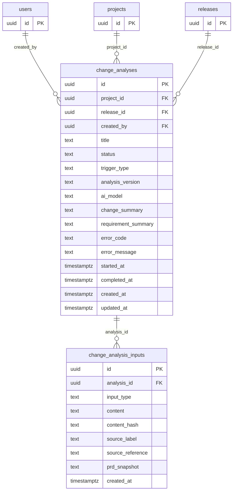

# Milestone 2 — Analysis Persistence Foundation

## Milestone Summary

| Field | Value |
|-------|-------|
| **Milestone** | M2 — Analysis Persistence Foundation |
| **Feature** | Change Intelligence (Feature 0001) |
| **Phase** | Phase 1 |
| **Depends on** | M1 — Isolated Feature Shell (complete) |
| **Unlocks** | M3 — Manual Input Analysis |
| **Status** | Specification Complete — Ready for Implementation |
| **Migration file** | `030_change_intelligence.sql` |
| **New tables** | `change_analyses`, `change_analysis_inputs` |
| **New API routes** | 6 endpoints under `/api/change-intelligence/analyses` |

---

## Executive Summary

Milestone 2 introduces the persistence layer for Change Intelligence analyses. It creates the two foundational database tables (`change_analyses` and `change_analysis_inputs`), the six API endpoints that manage them, and the draft/ready lifecycle that controls when inputs are locked for processing.

M2 does not run any AI analysis. It does not call the Anthropic API. It does not process diff or requirement content in any way. M2 purely builds the storage and management surface that M3 (Manual Input Analysis) will invoke when executing an analysis.

By the end of M2, a user can create a draft analysis record, attach input documents of various types, promote the analysis to the ready state, and retrieve the record later — without the application knowing anything about GitHub, pull request objects, or synchronization.

---

## Problem Statement

Milestone 1 delivered the feature shell: the navigation item, the empty-state page, and the feature flag. When a user navigates to `/change-intelligence`, they see a placeholder. There is no analysis record to save, no inputs to attach, and no database tables to store anything.

Before the AI analysis pipeline (M3) can run, the application needs:

1. A persistent record representing each analysis and its lifecycle state.
2. A storage surface for user-supplied inputs — PR diff text, requirement sources, and other context documents.
3. API endpoints that let the UI create, retrieve, and manage these records.
4. A clear lifecycle model defining when inputs can be modified and when they are locked.

Without this foundation, the M3 analysis pipeline has nowhere to write its results, and the application has no way to make analyses retrievable after the browser session ends.

---

## User Value

M2 delivers foundational infrastructure, not user-facing features. However, two user-observable behaviors are available immediately after M2 ships:

1. **Analysis draft management.** A user can create an analysis record with a title, attach input documents over time, and promote it to the ready state when the inputs are complete. The analysis persists across browser sessions.
2. **Analysis history.** A list of past analyses is retrievable. Users can see what analyses have been created and their current status.

Full end-to-end value — where the user submits inputs and receives structured AI findings — is delivered in M3.

---

## Goals

1. Introduce the `change_analyses` and `change_analysis_inputs` database tables via an additive migration.
2. Implement all six analysis management API endpoints.
3. Implement the draft/ready lifecycle so that inputs are locked when the analysis is promoted.
4. Enforce the content size limit (500,000 characters) at the API layer.
5. Enforce authorization: all routes call `requireAuth()` before any business logic.
6. Enforce the feature gate: all routes return 403 before the auth check when the feature is disabled.
7. Ensure the migration runs safely against the existing production schema with zero impact on existing tables.

---

## Non-Goals

The following are explicitly outside M2 scope. Any PR that includes this work will be rejected:

- GitHub API integration, OAuth flows, or webhook endpoints
- `ChangeRepository`, `ChangePullRequest`, `ChangeSyncRun`, or any provider entity
- Anthropic API calls of any kind
- Requirement extraction, diff analysis, or any AI processing
- Requirement comparison, risk analysis, or test generation
- The analysis submission form (UI is M3 scope)
- The analysis result display (UI is M3 scope)
- `change_requirements`, `change_risk_findings`, `change_generated_test_cases`, or `change_playwright_proposals` tables (these are created in later milestones as needed)
- Streaming, queuing, or background job infrastructure
- Per-user pilot flag (M13 scope)
- Any modification to existing QA Center routes, tables, or API contracts

---

## Personas

### Morgan — QA Engineer

Morgan is a QA Engineer who runs analyses on PRs during active development cycles. Morgan cares about being able to start an analysis, attach input documents, and return to it later if interrupted. Morgan expects the list of past analyses to be accessible without losing work.

### Alex — QA Lead

Alex is a QA Lead who reviews completed analyses and manages the team's use of Change Intelligence. Alex cares about being able to see all analyses across the team, filter by project or release, and understand the status of in-progress work.

Persona details: see `user-experience.md`.

---

## User Journeys

### Journey A — Create a draft analysis

1. Morgan navigates to `/change-intelligence`.
2. Morgan selects "New Analysis" and provides a title.
3. The UI calls `POST /api/change-intelligence/analyses` with `{ title, project_id }`.
4. The API creates a `change_analyses` record with `status: 'draft'` and returns the new `id`.
5. Morgan sees the empty draft analysis page, ready for input attachment.

### Journey B — Attach inputs to a draft analysis

1. Morgan opens a draft analysis.
2. Morgan pastes a PR diff into the diff input field.
3. The UI calls `POST /api/change-intelligence/analyses/:id/inputs` with `{ input_type: 'pr_diff', content }`.
4. The API stores the input, computes the `content_hash`, and returns the new input record (without the full content field).
5. Morgan adds a requirement document with `input_type: 'requirement_text'`.
6. The UI calls the inputs endpoint again with the requirement content.

### Journey C — Promote a draft to ready

1. Morgan has attached all required inputs to the draft analysis.
2. Morgan selects "Ready to Analyze."
3. The UI calls `PATCH /api/change-intelligence/analyses/:id` with `{ status: 'ready' }`.
4. The API validates that at least one `pr_diff` input is present.
5. The analysis status transitions from `draft` to `ready`.
6. Input fields lock — the UI no longer offers add/remove input actions.
7. M3 will check for `status: 'ready'` records to trigger the AI pipeline.

### Journey D — View analysis history

1. Alex opens the Change Intelligence section.
2. The UI calls `GET /api/change-intelligence/analyses?project_id=<id>&page=1&limit=20`.
3. The API returns a paginated list of analysis records with status, title, created_at, and input count.
4. Input content is not included in the list response.
5. Alex selects an analysis and the UI calls `GET /api/change-intelligence/analyses/:id`.
6. The detail response includes analysis metadata and input metadata, but not input content.

### Journey E — Cancel a draft analysis

1. Morgan decides not to proceed with a draft analysis.
2. The UI calls `PATCH /api/change-intelligence/analyses/:id` with `{ status: 'cancelled' }`.
3. The analysis transitions from `draft` to `cancelled`.
4. Cancelled analyses appear in the history with a cancelled status indicator.
5. No AI processing is ever triggered for a cancelled analysis.

---

## UX and Information Architecture

M2 establishes the data contract that the M3 UI will consume. The following UX expectations define the API behavior requirements:

- Analysis list: paginated, filterable by project and release, displays title, status, created_at, and input count. No input content.
- Analysis detail: displays analysis metadata plus input metadata (type, source_label, created_at). No input content in GET responses.
- Draft state: inputs can be added and removed. Title can be edited.
- Ready state: inputs are locked. Title can be edited. Status cannot be moved back to draft.
- Cancelled state: all fields read-only. No transitions permitted from cancelled.

The actual form components and result views are M3 scope. M2 provides the API contract they will consume.

---

## Feature Management

All M2 API routes enforce the feature gate using the same pattern established in M1:

```
POST /api/change-intelligence/analyses

1. if (!isChangeIntelligenceEnabled()) return { success: false, error: "Change Intelligence is not enabled." } (403)
2. const { ctx, errorResponse } = await requireAuth(); if (errorResponse) return errorResponse;
3. business logic
```

The feature gate check is always first, before auth, to avoid leaking the existence of routes when the feature is disabled.

The feature gate uses the server-side `CHANGE_INTELLIGENCE_ENABLED` environment variable confirmed in M1 (D-012). No new flag mechanism is introduced.

---

## Domain Model

M2 introduces two tables. All other Change Intelligence tables are deferred to the milestones that need them.

### Entities

**`change_analyses`** — Represents one analysis lifecycle. Created as a draft when the user initiates an analysis. Transitions to ready when the user locks inputs. Transitions to processing/completed/failed in M3. Can be cancelled from draft or ready.

**`change_analysis_inputs`** — Represents one input document attached to an analysis. Multiple inputs can be attached to a single analysis. Inputs are immutable once the parent analysis leaves the draft state. Each input has a type, optional label, optional source reference, and content.

### Relationship

- One `change_analyses` record has zero or more `change_analysis_inputs` records.
- Deleting a `change_analyses` record cascades to delete all its inputs.
- Inputs cannot be added to or removed from an analysis that is not in `draft` status.

### ER Diagram



---

## Logical Data Schema

### `change_analyses`

| Column | Type | Nullable | Default | Notes |
|--------|------|----------|---------|-------|
| `id` | `uuid` | NOT NULL | `gen_random_uuid()` | Primary key |
| `project_id` | `uuid` | NULL | — | FK → `projects(id)` ON DELETE SET NULL |
| `release_id` | `uuid` | NULL | — | FK → `releases(id)` ON DELETE SET NULL |
| `created_by` | `uuid` | NULL | — | FK → `users(id)` ON DELETE SET NULL (D-011) |
| `title` | `text` | NOT NULL | application-generated | User-provided or auto-generated display label. If the caller does not supply a title, the application generates `"Change Analysis — [Month Day, Year H:MM AM/PM]"` before insert. Title cannot be null or empty string. |
| `status` | `text` | NOT NULL | `'draft'` | See status taxonomy |
| `trigger_type` | `text` | NOT NULL | `'manual'` | `'manual'` in Phase 1; `'webhook'` reserved for future |
| `analysis_version` | `text` | NULL | — | Workflow version used; set by M3 on processing |
| `ai_model` | `text` | NULL | — | Model identifier; set by M3 on processing |
| `change_summary` | `text` | NULL | — | AI-generated change summary; set by M3 |
| `requirement_summary` | `text` | NULL | — | AI-generated requirement summary; set by M3 |
| `error_code` | `text` | NULL | — | Machine-readable error code; set by M3 on failure |
| `error_message` | `text` | NULL | — | Human-readable error detail; set by M3 on failure |
| `started_at` | `timestamptz` | NULL | — | Set by M3 when processing begins |
| `completed_at` | `timestamptz` | NULL | — | Set by M3 when processing completes or fails |
| `created_at` | `timestamptz` | NOT NULL | `NOW()` | Immutable |
| `updated_at` | `timestamptz` | NOT NULL | `NOW()` | Updated on every write |

The M3 result columns (`ai_model`, `change_summary`, `requirement_summary`, `error_code`, `error_message`, `started_at`, `completed_at`, `analysis_version`) are introduced in the M2 migration so that M3 can write to the same table without a schema change. They are nullable and must remain null for all M2-lifecycle records.

### `change_analysis_inputs`

| Column | Type | Nullable | Default | Notes |
|--------|------|----------|---------|-------|
| `id` | `uuid` | NOT NULL | `gen_random_uuid()` | Primary key |
| `analysis_id` | `uuid` | NOT NULL | — | FK → `change_analyses(id)` ON DELETE CASCADE |
| `input_type` | `text` | NOT NULL | — | See input-type taxonomy |
| `content` | `text` | NULL | — | Raw user-supplied content (D-017) |
| `content_hash` | `text` | NULL | — | SHA-256 of canonicalized content stored as 64 lowercase hex characters; null when content is null. Canonicalization: remove UTF-8 BOM, normalize CRLF→LF, preserve other whitespace, encode as UTF-8, SHA-256, lowercase hex. Computed server-side; never supplied by the caller. |
| `source_label` | `text` | NULL | — | User-supplied label (e.g., "Sprint 42 PRD") |
| `source_reference` | `text` | NULL | — | External reference (e.g., PRD document ID, Jira key) |
| `prd_snapshot` | `text` | NULL | — | Snapshot of PRD content at input time (OD-006) |
| `created_at` | `timestamptz` | NOT NULL | `NOW()` | Immutable |

---

## Keys, Constraints, and Indexes

### Primary Keys

- `change_analyses.id` — uuid, generated
- `change_analysis_inputs.id` — uuid, generated

### Foreign Keys

- `change_analyses.project_id` → `projects(id)` ON DELETE SET NULL
- `change_analyses.release_id` → `releases(id)` ON DELETE SET NULL
- `change_analyses.created_by` → `users(id)` ON DELETE SET NULL
- `change_analysis_inputs.analysis_id` → `change_analyses(id)` ON DELETE CASCADE

### Check Constraints

- `change_analyses.status` IN `('draft', 'ready', 'processing', 'completed', 'failed', 'cancelled')`
- `change_analyses.trigger_type` IN `('manual', 'webhook')`
- `change_analysis_inputs.input_type` IN `('pr_diff', 'requirement_text', 'acceptance_criteria', 'prd_text', 'jira_story', 'markdown_spec')`

### Indexes

| Index | Table | Column(s) | Purpose |
|-------|-------|-----------|---------|
| `idx_change_analyses_project_id` | `change_analyses` | `project_id` | Filter by project |
| `idx_change_analyses_release_id` | `change_analyses` | `release_id` | Filter by release |
| `idx_change_analyses_created_by` | `change_analyses` | `created_by` | Filter by user |
| `idx_change_analyses_status` | `change_analyses` | `status` | Filter by status (M3 polling) |
| `idx_change_analyses_created_at` | `change_analyses` | `created_at DESC` | Default sort for list |
| `idx_change_analysis_inputs_analysis_id` | `change_analysis_inputs` | `analysis_id` | Fetch inputs for analysis |
| `idx_change_analysis_inputs_type` | `change_analysis_inputs` | `analysis_id, input_type` | Filter inputs by type |

### Unique Constraints

| Constraint | Table | Definition | Purpose |
|-----------|-------|-----------|---------|
| `uq_change_analysis_inputs_pr_diff` | `change_analysis_inputs` | `UNIQUE (analysis_id) WHERE input_type = 'pr_diff'` | Enforces at most one PR diff input per analysis at the database layer; prevents race conditions from creating two pr_diff rows concurrently |

---

## Status Taxonomy

The `change_analyses.status` column follows a strict state machine. Transitions outside of these paths are rejected with a 409 response.

```
draft ──────────────────────────────► cancelled
  │
  │ PATCH { status: 'ready' }
  ▼
ready ──────────────────────────────► cancelled
  │
  │ M3 begins processing
  ▼
processing
  │
  ├──► completed
  └──► failed
```

| Status | Who Sets It | Meaning |
|--------|-------------|---------|
| `draft` | System (on creation) | Inputs can be added/removed. No AI processing yet. |
| `ready` | User (PATCH) | Inputs locked. Awaiting M3 processing trigger. |
| `processing` | M3 pipeline | AI analysis in progress. |
| `completed` | M3 pipeline | Analysis finished. All result fields populated. |
| `failed` | M3 pipeline | Analysis encountered an unrecoverable error. `error_code` and `error_message` set. |
| `cancelled` | User (PATCH) | User explicitly abandoned the analysis. |

### Allowed transitions from each status

| From | To (allowed) |
|------|-------------|
| `draft` | `ready`, `cancelled` |
| `ready` | `cancelled` |
| `processing` | `completed`, `failed` |
| `completed` | *(none)* |
| `failed` | *(none)* |
| `cancelled` | *(none)* |

Transitions not listed above must be rejected with `409 Conflict`.

---

## Input-Type Taxonomy

The `change_analysis_inputs.input_type` column uses a closed vocabulary. The API rejects any value not in this set.

| Value | Description |
|-------|-------------|
| `pr_diff` | Raw git diff text for the PR being analyzed |
| `requirement_text` | Free-form requirement text (pasted or typed) |
| `acceptance_criteria` | Acceptance criteria for the story or feature |
| `prd_text` | PRD document text (pasted; not linked to a `prd_documents` record) |
| `jira_story` | Jira story description (manually pasted in Phase 1) |
| `markdown_spec` | Markdown-formatted specification document |

At least one input with `input_type = 'pr_diff'` must be present before an analysis can be promoted from `draft` to `ready`.

---

## Normalization Rules

1. An analysis may have at most one `pr_diff` input at a time. If a `pr_diff` input already exists on a draft analysis, posting a new `pr_diff` replaces the existing one atomically (DELETE then INSERT in a single transaction). The response is 200 when replacing an existing diff, 201 when creating the first diff. The partial unique index `UNIQUE (analysis_id) WHERE input_type = 'pr_diff'` enforces this constraint at the database layer.
2. An analysis may have multiple requirement-type inputs (`requirement_text`, `acceptance_criteria`, `prd_text`, `jira_story`, `markdown_spec`) with no uniqueness constraint.
3. An analysis with no inputs is a valid draft. The ready transition enforces the presence of at least one `pr_diff` input.
4. `title` must be a non-empty string. If not provided or provided as an empty string, the application generates `"Change Analysis — [Month Day, Year H:MM AM/PM]"` before insert. PATCH cannot set title to null or empty string.

---

## Idempotency

- `POST /api/change-intelligence/analyses` is not idempotent. Each call creates a new record. Callers must not retry on 2xx.
- `POST /api/change-intelligence/analyses/:id/inputs` — behavior depends on `input_type`. For `input_type = 'pr_diff'`: if an existing `pr_diff` input is present on a draft analysis, the new content replaces it atomically (DELETE + INSERT). The response is 200. For all other input types: each call creates a new record; duplicate content is permitted.
- `PATCH /api/change-intelligence/analyses/:id` is idempotent for identical payloads on the same analysis.
- `DELETE /api/change-intelligence/analyses/:id/inputs/:inputId` is idempotent: deleting an already-deleted input returns 404 on the second call.

---

## API Contracts

All endpoints follow the established application conventions:

- Response envelope: `{ "success": true, "data": {} }` on success; `{ "success": false, "error": "Human-readable message" }` on failure (D-015).
- Every route calls `requireAuth()` first after the feature gate check (D-014).
- Feature gate returns 403 before the auth check (D-012).
- HTTP status codes follow REST conventions: 200, 201, 400, 401, 403, 404, 409, 500.

---

### Endpoint 1 — List Analyses

**`GET /api/change-intelligence/analyses`**

Returns a paginated list of analyses. Input content is excluded.

#### Query parameters

| Parameter | Type | Required | Default | Notes |
|-----------|------|----------|---------|-------|
| `project_id` | uuid | No | — | Filter by project |
| `release_id` | uuid | No | — | Filter by release |
| `status` | text | No | — | Filter by status |
| `created_by` | uuid | No | — | Filter by creator; not an authorization boundary — any authenticated user may filter by any creator UUID |
| `page` | integer | No | 1 | 1-indexed |
| `limit` | integer | No | 25 | Max 100 |

**Default sort:** `updated_at DESC, id DESC`. The secondary `id DESC` is required for deterministic ordering — without it, two analyses with identical `updated_at` timestamps can appear in different positions across paginated requests.

**Visibility:** Returns all analyses the authenticated user is authorized to view. In M2, all authenticated users can view all analyses (org-wide model, consistent with OD-005). The `created_by` filter narrows results but is not an authorization boundary.

#### Success response (200)

```json
{
  "success": true,
  "data": {
    "analyses": [
      {
        "id": "7f3c…",
        "title": "Sprint 42 auth refactor",
        "status": "ready",
        "trigger_type": "manual",
        "project_id": "a1b2…",
        "release_id": null,
        "created_by": "u9x1…",
        "input_count": 2,
        "created_at": "2026-07-26T14:00:00Z",
        "updated_at": "2026-07-26T14:05:00Z"
      }
    ],
    "pagination": {
      "page": 1,
      "limit": 25,
      "total": 1,
      "total_pages": 1
    }
  }
}
```

---

### Endpoint 2 — Create Analysis

**`POST /api/change-intelligence/analyses`**

Creates a new analysis record in `draft` status.

#### Request body

```json
{
  "title": "Sprint 42 auth refactor",
  "project_id": "a1b2…",
  "release_id": null
}
```

| Field | Type | Required | Notes |
|-------|------|----------|-------|
| `title` | string | No | Auto-generated as `"Change Analysis — [Month Day, Year H:MM AM/PM]"` if not provided or if empty. Non-empty string is stored after trimming (max 500 chars). |
| `project_id` | uuid | No | Must reference an existing project |
| `release_id` | uuid | No | Must reference an existing release if provided |

#### Success response (201)

```json
{
  "success": true,
  "data": {
    "id": "7f3c…",
    "title": "Sprint 42 auth refactor",
    "status": "draft",
    "trigger_type": "manual",
    "project_id": "a1b2…",
    "release_id": null,
    "created_by": "u9x1…",
    "created_at": "2026-07-26T14:00:00Z",
    "updated_at": "2026-07-26T14:00:00Z"
  }
}
```

#### Error responses

| Status | Condition |
|--------|-----------|
| 400 | `project_id` references a nonexistent project |
| 400 | `release_id` references a nonexistent release |
| 403 | Feature disabled |
| 401 | Not authenticated |

---

### Endpoint 3 — Get Analysis

**`GET /api/change-intelligence/analyses/:id`**

Returns the full analysis record including input metadata. Input content is excluded from the response.

#### Success response (200)

```json
{
  "success": true,
  "data": {
    "id": "7f3c…",
    "title": "Sprint 42 auth refactor",
    "status": "ready",
    "trigger_type": "manual",
    "project_id": "a1b2…",
    "release_id": null,
    "created_by": "u9x1…",
    "analysis_version": null,
    "ai_model": null,
    "change_summary": null,
    "requirement_summary": null,
    "error_code": null,
    "error_message": null,
    "started_at": null,
    "completed_at": null,
    "created_at": "2026-07-26T14:00:00Z",
    "updated_at": "2026-07-26T14:05:00Z",
    "inputs": [
      {
        "id": "i1a2…",
        "input_type": "pr_diff",
        "content_hash": "abc123…",
        "source_label": "PR #142",
        "source_reference": null,
        "created_at": "2026-07-26T14:01:00Z"
      },
      {
        "id": "i3b4…",
        "input_type": "requirement_text",
        "content_hash": "def456…",
        "source_label": "Auth requirements",
        "source_reference": null,
        "created_at": "2026-07-26T14:02:00Z"
      }
    ]
  }
}
```

Note: `content` and `prd_snapshot` are never included in GET responses (D-020).

#### Error responses

| Status | Condition |
|--------|-----------|
| 404 | Analysis not found |
| 403 | Feature disabled |
| 401 | Not authenticated |

---

### Endpoint 4 — Update Analysis

**`PATCH /api/change-intelligence/analyses/:id`**

Updates the analysis title or status.

#### Request body

```json
{
  "title": "Updated title",
  "status": "ready"
}
```

| Field | Type | Required | Notes |
|-------|------|----------|-------|
| `title` | string | No | Allowed in `draft` status only |
| `status` | text | No | See allowed status transitions |

#### Validation rules

- `title` updates are only allowed when `status = 'draft'`. If provided, must be a non-empty string after trimming; null or empty string returns 400. Title cannot be cleared once set.
- Status transition to `ready` requires at least one input with `input_type = 'pr_diff'`.
- Status transitions must follow the state machine defined in the Status Taxonomy section.
- An analysis in `completed`, `failed`, or `cancelled` state cannot be updated.

#### Success response (200)

```json
{
  "success": true,
  "data": {
    "id": "7f3c…",
    "title": "Sprint 42 auth refactor",
    "status": "ready",
    "updated_at": "2026-07-26T14:05:00Z"
  }
}
```

#### Error responses

| Status | Condition |
|--------|-----------|
| 400 | Invalid status transition |
| 400 | Transition to `ready` without a `pr_diff` input |
| 409 | Analysis is not in a mutable state |
| 404 | Analysis not found |
| 403 | Feature disabled |
| 401 | Not authenticated |

---

### Endpoint 5 — Add Input

**`POST /api/change-intelligence/analyses/:id/inputs`**

Adds an input document to a draft analysis.

#### Request body

```json
{
  "input_type": "pr_diff",
  "content": "diff --git a/...",
  "source_label": "PR #142",
  "source_reference": null
}
```

| Field | Type | Required | Notes |
|-------|------|----------|-------|
| `input_type` | text | Yes | Must be in the allowed input-type taxonomy |
| `content` | string | Yes | Maximum 500,000 characters (D-022) |
| `source_label` | string | No | User-supplied label |
| `source_reference` | string | No | External reference |

#### Validation rules

- Analysis must be in `draft` status. Inputs cannot be added to `ready`, `processing`, `completed`, `failed`, or `cancelled` analyses (D-019).
- `input_type` must be a value in the allowed input-type taxonomy.
- `content` must not exceed 500,000 characters.
- If `input_type = 'pr_diff'` and the analysis already has a `pr_diff` input, the existing input is replaced atomically (DELETE + INSERT in a single transaction). Returns 200 in this case (not 201).
- `content_hash` is computed server-side using the canonicalization pipeline: remove UTF-8 BOM, normalize CRLF→LF, preserve other whitespace, encode as UTF-8, SHA-256, 64 lowercase hex characters. It is not accepted from the client.

#### Success response (201 when creating the first pr_diff or any non-pr_diff input; 200 when replacing an existing pr_diff)

```json
{
  "success": true,
  "data": {
    "id": "i1a2…",
    "analysis_id": "7f3c…",
    "input_type": "pr_diff",
    "content_hash": "abc123…",
    "source_label": "PR #142",
    "source_reference": null,
    "created_at": "2026-07-26T14:01:00Z"
  }
}
```

Note: `content` is not returned in the response.

#### Error responses

| Status | Condition |
|--------|-----------|
| 400 | `input_type` not in allowed taxonomy |
| 400 | `content` exceeds 500,000 characters |
| 400 | `content` missing or empty |
| 409 | Analysis is not in `draft` status |
| 404 | Analysis not found |
| 403 | Feature disabled |
| 401 | Not authenticated |

---

### Endpoint 6 — Delete Input

**`DELETE /api/change-intelligence/analyses/:id/inputs/:inputId`**

Removes an input from a draft analysis.

#### Validation rules

- Analysis must be in `draft` status (D-019).
- The input must belong to the specified analysis. If `inputId` exists but belongs to a different analysis, return 404 (not 403) to avoid leaking information.

#### Success response (200)

```json
{
  "success": true,
  "data": {
    "deleted": true,
    "id": "i1a2…"
  }
}
```

#### Error responses

| Status | Condition |
|--------|-----------|
| 409 | Analysis is not in `draft` status |
| 404 | Input not found or does not belong to this analysis |
| 404 | Analysis not found |
| 403 | Feature disabled |
| 401 | Not authenticated |

---

## Pagination

All list endpoints use offset-based pagination with the following contract:

| Parameter | Default | Maximum |
|-----------|---------|---------|
| `page` | 1 | — |
| `limit` | 25 | 100 |

Requests with `limit` greater than 100 are rejected with 400.

**Default sort:** `updated_at DESC, id DESC`. The secondary `id DESC` sort is required; it guarantees deterministic ordering when two analyses have identical `updated_at` timestamps, preventing duplicate or missing items across pages.

Cursor-based pagination is deferred to M12 as a future optimization [FUTURE]. Offset pagination is sufficient for M2 at expected pilot scale.

Pagination metadata is always included in list responses:

```json
"pagination": {
  "page": 1,
  "limit": 25,
  "total": 47,
  "total_pages": 2
}
```

---

## Validation

### Request validation

All request bodies are validated on the server before any database operation. The application uses Zod on the server for structured validation. Validation failures return 400 with a descriptive error message.

Required fields that are absent return: `{ "success": false, "error": "Missing required field: <field_name>" }`

Invalid enum values return: `{ "success": false, "error": "Invalid input_type. Allowed values: pr_diff, requirement_text, acceptance_criteria, prd_text, jira_story, markdown_spec" }`

Oversized content returns: `{ "success": false, "error": "Content exceeds the 500,000 character limit." }`

### Content size limit

The 500,000-character hard limit on `change_analysis_inputs.content` is enforced at the API layer (D-022). Content exceeding this limit is rejected before any database write.

The rationale: 500,000 characters is approximately 125,000 tokens — well within Anthropic's context limits while preventing pathological inputs.

---

## Authorization

M2 uses org-level authorization, matching the existing application's access control model:

- Any authenticated user can create, list, retrieve, and update analyses.
- Any authenticated user can add and remove inputs from draft analyses.
- There is no per-analysis ownership check: an authenticated user can modify any analysis, including those created by other users.

Per-user access control is deferred to M13 (Controlled Team Pilot), where a database-backed per-user flag may be introduced (OD-012).

The `created_by` field provides an audit trail of who created each analysis, but it does not gate access.

---

## Security and Privacy

- Input content (PR diffs, requirement text) is stored as plain text. Full storage is permitted for internal use under D-017.
- Content is never returned in GET responses. The `content` and `prd_snapshot` columns are excluded from all API responses (D-020). Only `content_hash` is surfaced.
- The `content_hash` is computed server-side. Clients cannot supply or override it.
- The feature gate check comes before the auth check to avoid leaking the existence of routes when the feature is disabled.
- The delete endpoint returns 404 (not 403) when an input does not belong to the specified analysis, to avoid leaking input ID existence across analyses.
- No input data is logged at any log level. Log statements may include `analysis_id` and `input_type` but never `content`.

---

## Error Handling

### Standard error codes

| HTTP Status | Condition | Response body |
|-------------|-----------|---------------|
| 400 | Validation failure (missing field, bad type, oversized content, invalid enum) | `{ "success": false, "error": "<descriptive message>" }` |
| 401 | Not authenticated | `{ "success": false, "error": "Authentication required." }` |
| 403 | Feature disabled | `{ "success": false, "error": "Change Intelligence is not enabled." }` |
| 404 | Resource not found | `{ "success": false, "error": "Analysis not found." }` |
| 409 | State conflict — invalid status transition, analysis not in draft state for a mutation, or pr_diff uniqueness violation from a concurrent request | `{ "success": false, "error": "<specific conflict reason>" }` |
| 500 | Unexpected server error (any database error other than recognized constraint violations) | `{ "success": false, "error": "An unexpected error occurred." }` |

### Service-layer error translation

The service layer must translate specific PostgreSQL error codes into stable, safe HTTP responses. This translation is required — a 500 for an expected uniqueness conflict is a specification violation.

| Scenario | PostgreSQL signal | Required HTTP response | Safe error message |
|----------|------------------|----------------------|--------------------|
| Concurrent `pr_diff` insert violates the partial unique index | Error code `23505` (unique_violation) on constraint `uq_change_analysis_inputs_pr_diff` | **409 Conflict** | `"An analysis can have at most one PR diff input. The diff was already added by a concurrent request."` |
| Any other unexpected database failure | Any other PostgreSQL error code or driver error | 500 | `"An unexpected error occurred."` |

The constraint name (`uq_change_analysis_inputs_pr_diff`), SQL text, query parameters, driver details, and stack traces must never appear in any error response body or be logged at any level accessible to clients. The 409 for the pr_diff uniqueness case is deterministic, not a fallback.

### Isolation principle

An error in any M2 route must not affect any other QA Center page or feature. All M2 route handlers must catch exceptions and return structured error responses rather than allowing unhandled exceptions to propagate.

---

## Transactions

The following operations require database transactions:

1. **`POST /api/change-intelligence/analyses`** — No transaction required. Single row insert.
2. **`PATCH /api/change-intelligence/analyses/:id` (transition to `ready`)** — Read current status, validate transition, update status in a single statement using a conditional `WHERE status = 'draft'`. If zero rows affected, return 409.
3. **`POST /api/change-intelligence/analyses/:id/inputs`** — For `input_type = 'pr_diff'`, use a transaction to atomically DELETE any existing pr_diff and INSERT the new one. If the partial unique index fires despite the transaction (a concurrent request won the race), the service layer must catch PostgreSQL error code `23505` on constraint `uq_change_analysis_inputs_pr_diff` and return 409. Returning 500 for this case is a specification violation.
4. **`DELETE /api/change-intelligence/analyses/:id/inputs/:inputId`** — No transaction required. Single row delete with `WHERE analysis_id = :analysisId AND id = :inputId`.

The ready transition must be atomic to prevent race conditions where two concurrent PATCH requests both transition from draft to ready.

---

## Observability

### Logging

All M2 route handlers log the following at `info` level on success:

- Route name
- `analysis_id`
- HTTP status code
- Duration (ms)

On error, log at `error` level:

- Route name
- `analysis_id` (if available)
- HTTP status code
- Error message (sanitized — no content)
- Stack trace

### Metrics (future — M12 scope)

The following metrics are identified now for M12 instrumentation:

- `ci.analysis.created` — count of analyses created
- `ci.analysis.ready` — count of analyses promoted to ready
- `ci.analysis.cancelled` — count of analyses cancelled
- `ci.input.added` — count of inputs added, by type
- `ci.input.deleted` — count of inputs deleted

---

## Performance

### Expected volumes (Phase 1 pilot)

- Analyses: < 100 total in Phase 1
- Inputs per analysis: 2–5 typical, 10 maximum
- Concurrent users: < 10 during pilot

### Performance requirements

- All M2 endpoints must respond in < 500ms for a cold request on typical pilot volumes.
- List queries must use indexed columns for sorting and filtering (indexes defined in Keys section).
- Content fields are excluded from list queries to avoid unnecessary data transfer.

---

## Migration Strategy

### File

`030_change_intelligence.sql` (D-010)

### Safety requirements

1. The migration must be additive only. No existing table is modified.
2. All new columns are either NOT NULL with a safe default or nullable.
3. The migration must be tested against a copy of the production schema before merge.
4. Applying the migration twice must not cause errors (use `CREATE TABLE IF NOT EXISTS`).

### Migration content (specification-level — implementation subject to verification)

```sql
-- Migration 030: Change Intelligence — Analysis Persistence Foundation
-- Milestone: M2

CREATE TABLE IF NOT EXISTS change_analyses (
  id                  UUID        NOT NULL DEFAULT gen_random_uuid() PRIMARY KEY,
  project_id          UUID        REFERENCES projects(id) ON DELETE SET NULL,
  release_id          UUID        REFERENCES releases(id) ON DELETE SET NULL,
  created_by          UUID        REFERENCES users(id) ON DELETE SET NULL,
  title               TEXT        NOT NULL,                           -- application always generates before insert
  status              TEXT        NOT NULL DEFAULT 'draft',
  trigger_type        TEXT        NOT NULL DEFAULT 'manual',
  analysis_version    TEXT,
  ai_model            TEXT,
  change_summary      TEXT,
  requirement_summary TEXT,
  error_code          TEXT,
  error_message       TEXT,
  started_at          TIMESTAMPTZ,
  completed_at        TIMESTAMPTZ,
  created_at          TIMESTAMPTZ NOT NULL DEFAULT NOW(),
  updated_at          TIMESTAMPTZ NOT NULL DEFAULT NOW(),

  CONSTRAINT chk_change_analyses_status
    CHECK (status IN ('draft','ready','processing','completed','failed','cancelled')),
  CONSTRAINT chk_change_analyses_trigger_type
    CHECK (trigger_type IN ('manual','webhook'))
);

CREATE TABLE IF NOT EXISTS change_analysis_inputs (
  id               UUID        NOT NULL DEFAULT gen_random_uuid() PRIMARY KEY,
  analysis_id      UUID        NOT NULL REFERENCES change_analyses(id) ON DELETE CASCADE,
  input_type       TEXT        NOT NULL,
  content          TEXT,
  content_hash     TEXT,
  source_label     TEXT,
  source_reference TEXT,
  prd_snapshot     TEXT,
  created_at       TIMESTAMPTZ NOT NULL DEFAULT NOW(),

  CONSTRAINT chk_change_analysis_inputs_type
    CHECK (input_type IN ('pr_diff','requirement_text','acceptance_criteria',
                          'prd_text','jira_story','markdown_spec'))
);

CREATE INDEX IF NOT EXISTS idx_change_analyses_project_id  ON change_analyses (project_id);
CREATE INDEX IF NOT EXISTS idx_change_analyses_release_id  ON change_analyses (release_id);
CREATE INDEX IF NOT EXISTS idx_change_analyses_created_by  ON change_analyses (created_by);
CREATE INDEX IF NOT EXISTS idx_change_analyses_status      ON change_analyses (status);
CREATE INDEX IF NOT EXISTS idx_change_analyses_created_at  ON change_analyses (created_at DESC);

CREATE INDEX IF NOT EXISTS idx_change_analysis_inputs_analysis_id
  ON change_analysis_inputs (analysis_id);
CREATE INDEX IF NOT EXISTS idx_change_analysis_inputs_type
  ON change_analysis_inputs (analysis_id, input_type);

CREATE UNIQUE INDEX IF NOT EXISTS uq_change_analysis_inputs_pr_diff
  ON change_analysis_inputs (analysis_id)
  WHERE input_type = 'pr_diff';
```

This is a specification-level schema. The implementation team must verify the exact column order, constraint names, and index names against the production schema conventions before committing the migration file.

---

## Rollout Plan

1. Merge the M2 implementation PR with the feature flag disabled.
2. Run `030_change_intelligence.sql` on the staging database and verify all new tables and indexes are created correctly.
3. Run the backward compatibility regression checklist (BC-01 through BC-15) in staging.
4. Run all M2 acceptance criteria in staging.
5. Enable the feature flag (`CHANGE_INTELLIGENCE_ENABLED=true`) in staging.
6. Verify that the `/change-intelligence` page shows the updated state.
7. Disable the feature flag before releasing to production.
8. Apply the migration to production.
9. Verify backward compatibility criteria pass in production (feature flag disabled).
10. Enable the feature flag in production for the pilot group (M13 scope).

---

## Acceptance Criteria

Full acceptance criteria are in `acceptance-criteria.md` as M2-AC-01 through M2-AC-46. Summarized by group:

| Group | Criteria | Count |
|-------|---------|-------|
| Feature gate and authentication | M2-AC-01 to M2-AC-03 | 3 |
| POST /analyses (create) | M2-AC-04 to M2-AC-11 | 8 |
| GET /analyses (list) | M2-AC-12 to M2-AC-15 | 4 |
| GET /analyses/:id (detail) | M2-AC-16 to M2-AC-19 | 4 |
| PATCH /analyses/:id (update) | M2-AC-20 to M2-AC-24 | 5 |
| POST /analyses/:id/inputs (add input) | M2-AC-25 to M2-AC-29 | 5 |
| DELETE /analyses/:id/inputs/:inputId (remove input) | M2-AC-30 to M2-AC-32 | 3 |
| Migration | M2-AC-33 to M2-AC-34 | 2 |
| Data integrity | M2-AC-35 to M2-AC-36 | 2 |
| Title auto-generation and PATCH validation | M2-AC-37 to M2-AC-38 | 2 |
| Visibility, sort, and pagination | M2-AC-39 to M2-AC-41 | 3 |
| PR diff uniqueness and replace behavior | M2-AC-42 to M2-AC-43 | 2 |
| Content hash canonicalization | M2-AC-44 to M2-AC-46 | 3 |
| **Total** | | **46** |

---

## Test Strategy

### Unit tests

- Status machine validation: all valid and invalid transitions
- Content size limit enforcement
- `input_type` enum validation
- `content_hash` computation (SHA-256 correctness)
- Pagination parameter validation

### API tests

M2 is the first milestone in this feature to have API-level test coverage. Tests must cover:

- All 6 endpoints × happy path
- All 6 endpoints × unauthenticated request (401)
- All 6 endpoints × feature disabled (403)
- POST /analyses: invalid project_id, invalid release_id
- PATCH /analyses/:id: each invalid status transition
- PATCH /analyses/:id: transition to ready without pr_diff input
- POST /analyses/:id/inputs: each invalid input_type
- POST /analyses/:id/inputs: content exceeding 500,000 characters
- POST /analyses/:id/inputs: replace existing pr_diff (returns 200; only one pr_diff remains)
- POST /analyses/:id/inputs: on non-draft analysis (409)
- DELETE /analyses/:id/inputs/:inputId: input belongs to different analysis (404)
- DELETE /analyses/:id/inputs/:inputId: on non-draft analysis (409)

### Migration tests

- Migration runs cleanly on a copy of the production schema
- Migration is idempotent (apply twice, no errors)
- All existing tables remain unchanged after migration

### Regression tests

Run the full regression smoke test checklist from `implementation-plan.md` before merging.

---

## Definition of Done

In addition to the standard Definition of Done in `acceptance-criteria.md`:

- [ ] All 46 M2 acceptance criteria pass (M2-AC-01 through M2-AC-46)
- [ ] All 15 backward compatibility criteria (BC-01 through BC-15) pass
- [ ] Unit tests exist for status machine, enum validation, content size, and content_hash
- [ ] API tests cover all 6 endpoints × happy path and all error cases listed above
- [ ] Migration `030_change_intelligence.sql` tested against production schema copy
- [ ] Migration verified idempotent
- [ ] All existing QA Center routes verified unaffected (regression checklist)
- [ ] Feature flag disabled state: all existing workflows pass
- [ ] Feature flag enabled state: M2 endpoints are accessible and function correctly
- [ ] No Anthropic API call is made by any M2 code path
- [ ] Input content is not returned in any GET response
- [ ] Log statements contain no input content
- [ ] `README.md` and `CHANGELOG.md` updated

---

## Dependencies

| Dependency | Status | Notes |
|-----------|--------|-------|
| M0 — Existing System Discovery | COMPLETE | Migration number, FK conventions, auth patterns all confirmed |
| M1 — Isolated Feature Shell | COMPLETE | Feature gate, navigation item, and route structure in place |
| `requireAuth()` pattern | Confirmed (M0) | Used by all M2 routes |
| `isChangeIntelligenceEnabled()` helper | Implemented (M1) | Used by all M2 routes |
| Response envelope `{ success, data/error }` | Confirmed (D-015) | Used by all M2 routes |
| `030_change_intelligence.sql` migration file | New (M2) | Must not conflict with migrations 010–029 |

---

## Risks

| Risk | Likelihood | Impact | Mitigation |
|------|-----------|--------|-----------|
| Migration conflicts with schema.sql inline content | Low | High | Verify against production schema before merging; use `CREATE TABLE IF NOT EXISTS` |
| Status transition race conditions on concurrent PATCH requests | Low | Medium | Use conditional `WHERE status = 'draft'` in UPDATE and check rows affected |
| Input content inadvertently logged | Low | Medium | Explicitly audit all log statements before merge; never log `content` |
| Large input validation bypass | Low | High | Enforce the 500,000-character limit before any database write, not after |
| M3 integration assumption mismatch | Medium | Medium | M2 spec documents all column names and types; M3 must verify against M2 tables before implementing |

---

## Open Questions

All five open questions have been resolved. See `decisions.md` D-023 through D-027.

#### OQ-M2-01 — Should title be required or optional — RESOLVED

**Resolution:** `title` is NOT NULL in the database. The application auto-generates `"Change Analysis — [Month Day, Year H:MM AM/PM]"` if the caller does not supply a title. PATCH cannot clear the title. See D-023.

#### OQ-M2-02 — Should the list endpoint filter by created_by or return all analyses — RESOLVED

**Resolution:** The list endpoint returns all analyses the authenticated user is authorized to view (org-wide in M2). `created_by` is an optional convenience filter parameter, not an authorization boundary. See D-024.

#### OQ-M2-03 — Is offset pagination sufficient for Phase 1 pilot volumes — RESOLVED

**Resolution:** Offset pagination is used with a default page size of 25, maximum 100. Default sort is `updated_at DESC, id DESC`. Cursor-based pagination is deferred to M12 [FUTURE]. See D-025.

#### OQ-M2-04 — Should pr_diff uniqueness be enforced at the DB level or API level only — RESOLVED

**Resolution:** Enforced at both layers. Database: partial unique index `UNIQUE (analysis_id) WHERE input_type = 'pr_diff'`. Service layer: replace behavior on draft analyses (DELETE + INSERT in one transaction). Returns 200 on replace, 201 on create. See D-026.

#### OQ-M2-05 — What is the exact SHA-256 encoding for content_hash — RESOLVED

**Resolution:** SHA-256 stored as 64 lowercase hexadecimal characters, no algorithm prefix. Canonicalization: remove UTF-8 BOM, normalize CRLF→LF, preserve other whitespace, encode as UTF-8, SHA-256, lowercase hex. Hash is computed server-side; callers must not supply it. See D-027.

---

## M3 Handoff

At the end of M2, the following contract is available for M3 (Manual Input Analysis) to build against:

- A `change_analyses` record in `status = 'ready'` with at least one `pr_diff` input and at least one requirement-type input can be submitted for AI analysis.
- M3 must:
  1. Query `change_analyses WHERE status = 'ready'` (or be triggered by a user action on a specific ready record).
  2. Transition `status` to `'processing'` atomically before beginning any AI call.
  3. Read inputs from `change_analysis_inputs` (using the `content` column, which is stored but never returned by M2 GET endpoints).
  4. On completion: set `status = 'completed'`, populate `ai_model`, `change_summary`, `requirement_summary`, `analysis_version`, `started_at`, `completed_at`.
  5. On failure: set `status = 'failed'`, populate `error_code`, `error_message`, `started_at`, `completed_at`.
- M3 does not need to add new columns to `change_analyses`. All result columns are present from the M2 migration.
- M3 does not need to modify `change_analysis_inputs`. The content is stored and retrievable.
- M3 will introduce `change_requirements` and other output tables in a new migration.

---

## Future Provider Boundary

[FUTURE] In a later phase (M9 — Repository and Provider Foundation), the platform will support automatic PR ingestion from GitHub and other source control providers. The boundary between M2 and that future capability is intentional:

- M2 `change_analyses` records are not tied to any GitHub PR, commit, or repository object. They are agnostic to how the diff content arrived.
- When provider integration is added, new tables (`change_repositories`, `change_pull_requests`) will be introduced. A nullable `pull_request_id` foreign key may be added to `change_analyses` at that time.
- The `trigger_type = 'webhook'` value on `change_analyses.trigger_type` is reserved for this future use. It must not be set by any M2 code path.
- D-004 remains valid: Phase 1 does not require GitHub API integration.

The persistence layer introduced in M2 is deliberately designed to be extended without modification. The provider boundary does not require any M2 schema changes.
